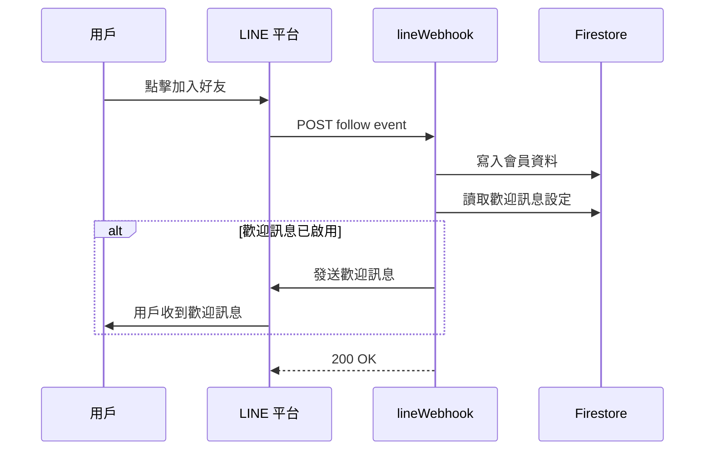

# 新功能使用指南

## 📋 功能概述

本次更新新增了兩大功能模組：

1. **會員列表** - 獨立的 LINE 會員管理頁面
2. **歡迎訊息** - 用戶加入好友時自動發送歡迎訊息

---

## 🎯 一、會員列表功能

### 功能說明

「會員列表」是一個獨立的頁面，專門顯示所有透過 LINE 官方帳號加入好友的會員，與「客戶列表」分開管理。

**客戶列表 vs 會員列表的區別：**

- **客戶列表**：只顯示有預約記錄的客戶
- **會員列表**：顯示所有加入 LINE OA 的會員（包括未預約過的）

### 使用方式

1. **進入會員列表**

   - 登入管理後台
   - 點擊左側導航欄的「會員」圖標（badge 圖標）
   - 或在頂部標籤切換到「會員列表」

2. **查看會員資訊**

   - 左側面板顯示所有活躍會員
   - 顯示會員的 LINE 大頭貼和名稱
   - 顯示加入時間
   - 點擊會員卡片查看詳細資訊

3. **會員詳細資訊包含：**

   - LINE ID（部分顯示）
   - 電話號碼（如有提供）
   - Email（如有提供）
   - 加入時間
   - 會員狀態（活躍 / 已封鎖）

4. **搜尋功能**
   - 可搜尋會員名稱
   - 可搜尋電話號碼
   - 即時過濾搜尋結果

### 會員狀態說明

- **✓ 活躍**：用戶已加入 LINE OA 且未封鎖
- **已封鎖**：用戶已封鎖或取消好友

**注意**：已封鎖的用戶不會顯示在會員列表中，系統會自動過濾。

---

## 💬 二、歡迎訊息功能

### 功能說明

當用戶在 LINE 中點擊「加入好友」時，系統會自動發送您設定的歡迎訊息。這是建立第一印象的絕佳機會！

### 設定步驟

1. **進入自動回覆管理**

   - 登入管理後台
   - 點擊左側導航欄的「自動回覆」圖標（機器人圖標）

2. **切換到歡迎訊息標籤**

   - 在自動回覆頁面頂部
   - 點擊「歡迎訊息」標籤（波浪圖標）

3. **編輯歡迎訊息**

   - 在文字框中輸入歡迎訊息內容
   - 最多 2000 字元
   - 支援換行和特殊符號

4. **啟用歡迎訊息**

   - 勾選「啟用歡迎訊息」選項
   - 點擊「儲存設定」按鈕

5. **測試**
   - 使用測試 LINE 帳號加入您的 OA
   - 應該會立即收到歡迎訊息

### 歡迎訊息建議內容

建議在歡迎訊息中包含：

✅ **友善的問候語**

```
歡迎加入 XX 寵物美容！🐾
```

✅ **店家簡介**

```
我們是專業的寵物美容工作室，
擁有 10 年以上的服務經驗。
```

✅ **服務項目或特色**

```
提供服務：
• 洗澡美容
• 造型設計
• SPA 護理
• 寵物健檢
```

✅ **預約方式說明**

```
💡 如何預約：
請點擊下方選單的「立即預約」按鈕，
選擇您方便的日期和時間。
```

### 完整範例

```
歡迎加入 XX 寵物美容！🐾

我們是專業的寵物美容工作室，致力於為每一位毛孩提供最優質的服務。

🌟 服務項目：
• 洗澡美容
• 造型設計
• SPA 護理
• 寵物健檢

📅 預約方式：
點擊下方選單的「立即預約」按鈕即可預約。

❓ 有任何問題，歡迎隨時詢問！
我們期待為您和您的寶貝服務 ❤️
```

### 注意事項

⚠️ **重要提醒**

1. **立即生效**：儲存後立即生效，新加入的好友會收到歡迎訊息
2. **不能使用圖片**：目前只支援純文字歡迎訊息
3. **Reply Token**：使用 Reply API，不計入 Push 配額
4. **一次性發送**：每個用戶加入時只會發送一次
5. **重新加好友**：如果用戶曾經封鎖後又重新加好友，會再次收到歡迎訊息

---

## 🔧 三、技術架構說明

### 會員資料儲存結構

```
Firestore:
  shops/
    {shopId}/
      users/
        {userId}/
          - uid: string (LINE User ID)
          - displayName: string
          - pictureUrl: string
          - shopId: string
          - followedAt: string (ISO 8601)
          - status: "active" | "blocked"
          - role: "customer"
          - createdAt: Timestamp
```

### 歡迎訊息儲存結構

```
Firestore:
  shops/
    {shopId}/
      settings/
        welcome/
          - message: string
          - isActive: boolean
          - updatedAt: string (ISO 8601)
          - createdAt: string (ISO 8601)
```

### 自動化流程



---

## 📊 四、功能特色

### 會員列表

✅ **即時同步**

- 用戶加入好友後立即顯示
- 自動更新會員狀態

✅ **完整資訊**

- 顯示 LINE 個人資料
- 記錄加入時間
- 追蹤會員狀態

✅ **獨立管理**

- 與客戶列表分開
- 專注於 LINE 會員
- 清晰的分類

### 歡迎訊息

✅ **自動發送**

- 用戶加入即發送
- 無需手動操作
- 節省人力成本

✅ **靈活設定**

- 隨時編輯內容
- 一鍵啟用/停用
- 即時生效

✅ **免費使用**

- 使用 Reply API
- 不計入 Push 配額
- 無額外費用

---

## 🚀 五、使用場景

### 場景 1：新店開業

設定一個溫馨的歡迎訊息，介紹您的店家和服務：

```
🎉 歡迎加入 XX 寵物美容！

我們是新開幕的寵物美容工作室，
現在加入好友即享首次美容 9 折優惠！

📍 地址：台北市...
⏰ 營業時間：週一至週日 10:00-20:00
📞 預約專線：02-xxxx-xxxx

期待為您的寶貝提供服務！❤️
```

### 場景 2：活動宣傳

在歡迎訊息中提及正在進行的活動：

```
歡迎加入 XX 寵物美容！🐾

🎊 本月限定活動：
加入好友即贈送寵物洗澡體驗券一張！

請出示此訊息給櫃檯人員即可使用。

立即預約 👉 點擊下方選單
```

### 場景 3：品牌形象

展現專業形象，建立信任感：

```
您好！歡迎加入 XX 寵物美容 🏆

我們是：
✓ 擁有國際認證的專業美容師
✓ 使用天然無添加美容產品
✓ 提供專屬一對一服務
✓ 每月服務超過 500 隻毛孩

讓我們用專業與愛心，
為您的寶貝打造最美好的時光！

預約諮詢請點擊下方選單 💕
```

---

## 🔍 六、常見問題

### Q1：會員列表和客戶列表有什麼區別？

**A**：

- **客戶列表**：只顯示有預約記錄的客戶
- **會員列表**：顯示所有加入 LINE OA 的會員（包括未預約過的）

### Q2：歡迎訊息可以包含圖片嗎？

**A**：目前只支援純文字訊息。如需發送圖片，請使用其他推播功能。

### Q3：歡迎訊息會計入 LINE 配額嗎？

**A**：不會！歡迎訊息使用 Reply API，完全免費，不計入 Push 配額。

### Q4：用戶封鎖後重新加好友，會再收到歡迎訊息嗎？

**A**：會的。每次 follow 事件都會觸發歡迎訊息（如果已啟用）。

### Q5：如何知道有新會員加入？

**A**：

1. 查看會員列表的總人數
2. 會員會依加入時間排序，最新的在最上方
3. 未來可能新增即時通知功能

### Q6：會員資料會自動更新嗎？

**A**：是的。系統會自動追蹤：

- 用戶加入好友（status: active）
- 用戶封鎖或取消好友（status: blocked）

### Q7：可以手動新增會員嗎？

**A**：不行。會員只能透過 LINE 官方帳號的 follow 事件自動新增，確保資料準確性。

### Q8：歡迎訊息可以針對不同用戶發送不同內容嗎？

**A**：目前不支援。所有用戶收到的歡迎訊息都相同。未來可能新增分群功能。

---

## 📝 七、最佳實踐

### 歡迎訊息編寫技巧

1. **保持簡潔**：避免過長，建議 200-300 字
2. **重點突出**：使用表情符號和換行增加可讀性
3. **行動呼籲**：明確告知用戶下一步該做什麼
4. **定期更新**：根據季節、活動更新內容
5. **測試效果**：發送後用測試帳號檢查顯示效果

### 會員管理建議

1. **定期檢視**：每週查看新增會員數量
2. **主動互動**：對新會員發送個人化訊息
3. **轉換追蹤**：觀察會員轉換為預約客戶的比例
4. **優化內容**：根據轉換率調整歡迎訊息
5. **保持活躍**：定期推送有價值的內容給會員

---

## ✅ 八、檢查清單

### 初次設定

- [ ] 確認 LINE Webhook URL 已正確設定
- [ ] 確認 Channel Access Token 有效
- [ ] 設定歡迎訊息內容
- [ ] 啟用歡迎訊息功能
- [ ] 使用測試帳號驗證功能

### 日常維護

- [ ] 每週檢視新增會員數量
- [ ] 定期更新歡迎訊息內容
- [ ] 關注會員轉換率
- [ ] 處理封鎖用戶的後續追蹤
- [ ] 優化會員互動策略

---

## 📚 相關文件

- [LINE Follow Webhook 設定指南](LINE_FOLLOW_WEBHOOK_GUIDE.md)
- [LINE 訊息配額管理](LINE_QUOTA_USAGE_GUIDE.md)
- [自動回覆功能說明](LINE_AUTO_REPLY_DEPLOYMENT.md)

---

**最後更新**：2024-12-18  
**版本**：v2.0.0  
**作者**：AI Assistant
